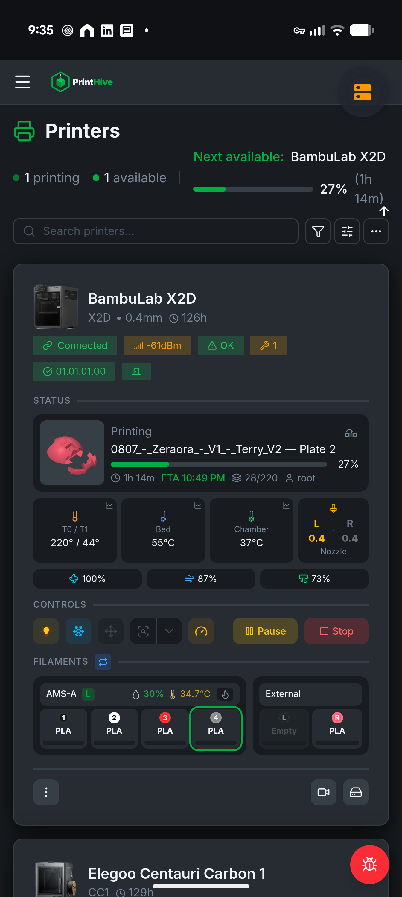
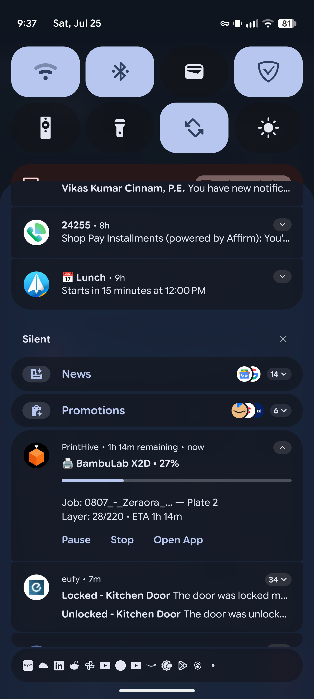
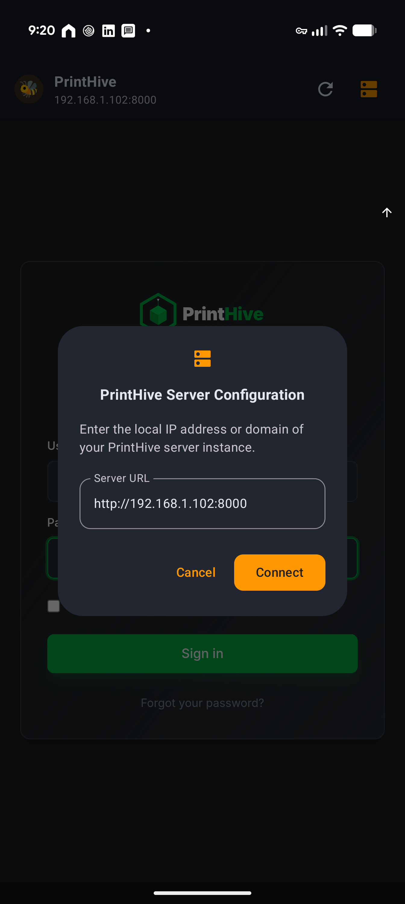

# PrintHive Android Webclient

<p align="center">
  
</p>

<p align="center">
  <b>The Simplest, Hassle-Free 3D Printing Companion for Android</b><br/>
  <i>Full edge-to-edge web client experience with native Android 16+ Live Updates, NFC spool scanning, and interactive lock-screen controls.</i>
</p>

<p align="center">
  <a href="https://github.com/anuragdeshpande/PrintHive-Android-Webclient/releases"></a>
  
  
  
</p>

---

## 💡 What is PrintHive Webclient?

**PrintHive Webclient** is an open-source Android application built specifically for 3D printing enthusiasts, makers, and print farm managers who want the **simplest, most hassle-free experience** to control and monitor their 3D printers on mobile devices.

Instead of maintaining a separate mobile UI that trails behind web server capabilities, PrintHive Webclient combines a high-performance **100% full-screen immersive web engine** with **native Android hardware integrations**. Any new feature, printer model, filament preset, or control added to your PrintHive server immediately appears in your app without needing an app update!

---

## 🎯 Who is it for?

PrintHive Webclient is designed for anyone who wants **complete, uncompromised control of their 3D printer fleet** without friction:

- **Hobbyists & Makers** who want to check print progress, temperatures, and camera feeds on their phone from anywhere in the house.
- **Print Farm Managers** operating multiple Bambu Lab, Elegoo, Flashforge, or OctoPrint machines who need real-time multi-printer monitoring.
- **Users who want zero hassle**: Point the app to your server URL once, and enjoy a native app experience with **Android 16+ Live Activity lock-screen notifications**.

---

## ✨ Key Features

| Feature | Description |
| :--- | :--- |
| 📱 **100% Immersive Full-Screen UI** | Borderless edge-to-edge display with automatic status bar inset padding (`statusBarsPadding()`). Never draws behind the camera notch or cuts off top menu controls. |
| ⚡ **Android 16+ Live Activity Notifications** | Prominent ongoing notifications on your lock screen and status bar with real-time percentage progress bars, layer counts (`28/220`), and ETA timers. |
| ⏸️ **Interactive Lock Screen Actions** | Pause, Stop, or Open the app directly from your phone's notification banner card without unlocking your device. |
| 🏷️ **Native NFC & Camera Bridge** | Built-in NDEF NFC scanner to tap physical spool tags (`printhive://`) and register filaments into your inventory instantly. |
| 🗄️ **Instant Server IP Configuration** | Elegant floating configuration button (`🗄️`) and onboarding setup screen to switch local server IPs (`http://192.168.1.102:8000`) anytime. |
| 🔄 **Automatic Feature Sync** | 100% feature parity with your PrintHive server dashboard — camera streams, AMS/MMU filaments, print scheduling, and temperature charts work out of the box. |

---

## 📸 Screenshots & Showcase

<p align="center">
  
  &nbsp;&nbsp;&nbsp;&nbsp;
  
  &nbsp;&nbsp;&nbsp;&nbsp;
  
</p>

---

## 📥 Installation

### Option 1: Download Pre-built APK (Recommended)
1. Go to the [**Releases Page**](https://github.com/anuragdeshpande/PrintHive-Android-Webclient/releases).
2. Download the latest `PrintHive-Webclient-v1.x.x-release.apk`.
3. Open the APK on your Android device and grant installation permissions.

### Option 2: Build from Source
```bash
# Clone the repository
git clone https://github.com/anuragdeshpande/PrintHive-Android-Webclient.git
cd PrintHive-Android-Webclient

# Compile release APK using Gradle
./gradlew assembleRelease
```
The compiled APK will be located at:
`app/build/outputs/apk/release/app-release-unsigned.apk`

---

## 🚀 Quick Setup

1. Launch **PrintHive** on your Android phone.
2. Enter your PrintHive server URL on the setup screen (e.g. `http://192.168.1.102:8000`).
3. Tap **Connect to PrintHive**.
4. Grant Notification permissions when prompted to enable **Android 16+ Live Activity notifications**.

---

## ⚙️ Architecture & Tech Stack

- **UI Framework**: Android Jetpack Compose + Material 3 Expressive Design
- **Web Engine**: Hardware-Accelerated Chrome WebView with `@JavascriptInterface` bridge (`window.PrintHiveNative`)
- **Real-Time Data Engine**: OkHttp 4 WebSocket Client (`ws://<server_ip>:8000/api/v1/ws`)
- **Live Notifications**: Android 16+ Prominent Ongoing Notification API (`NotificationCompat.CATEGORY_PROGRESS`)
- **Hardware Integration**: Android NFC NDEF Foreground Dispatch & CameraX API
- **CI/CD**: GitHub Actions with Conventional Commit automated release note generator

---

## 📄 License

This project is licensed under the **GNU General Public License v3.0** - see the [LICENSE](LICENSE) file for details.
